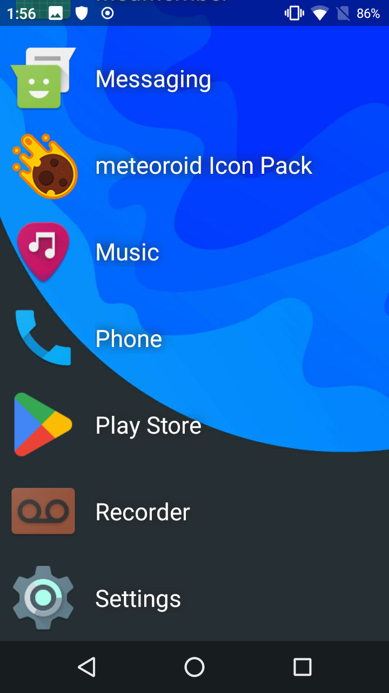
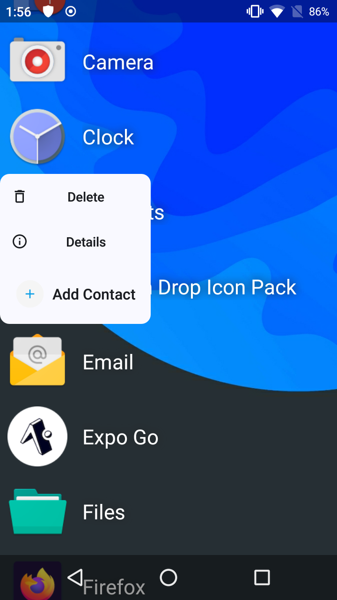

# QuickLauncher

**Small and simple launcher for Android.**

A clean, lightweight launcher designed for simplicity and speed.

Quick Launcher offers a minimal home screen experience with a vertical layout for organizing your apps. Built with performance in mind, it's optimized to run smoothly even on **older or low-spec devices**, ensuring a fast and responsive experience without unnecessary bloat.

**Key Features:**

* Grid-based app layout for easy access and organization

* Ultra-lightweight - uses minimal memory and storage

* No ads, no distractions - just your apps, clean and simple

* Perfect for older phones, secondary devices, or users who prefer a minimalist setup

Whether you're looking to revive an old phone or just want a no-nonsense launcher that gets out of your way, Quick Launcher delivers.

## Screenshots

